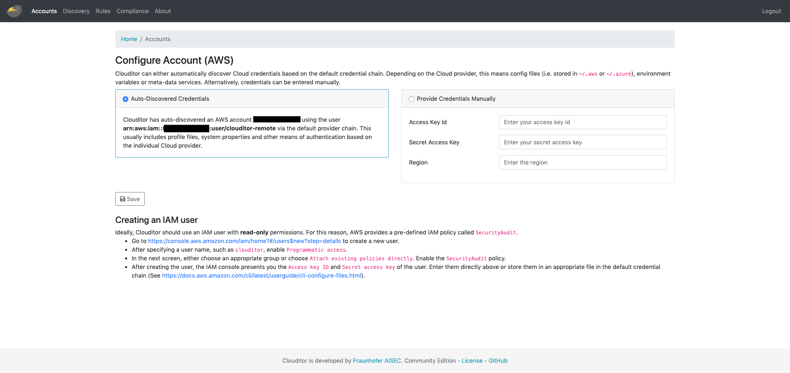
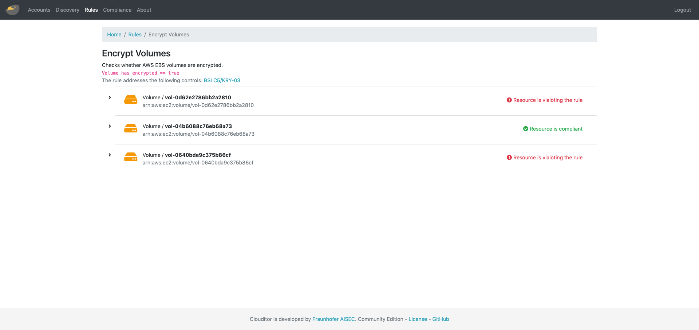

# Clouditor Community Edition [](https://circleci.com/gh/clouditor/clouditor) [](https://sonarcloud.io/dashboard?id=clouditor_clouditor) [](https://sonarcloud.io/dashboard?id=clouditor_clouditor) [](https://sonarcloud.io/dashboard?id=clouditor_clouditor) [](https://sonarcloud.io/dashboard?id=clouditor_clouditor)


# Introduction

Clouditor is a tool which supports continuous cloud assurance. Its main goal is to continuously evaluate if a cloud-based application (built using, e.g., Amazon Web Services (AWS) or Microsoft Azure) is configured in a secure way and thus complies with security requirements defined by, e.g., Cloud Computing Compliance Controls Catalogue (C5) issued by the German Office for Information Security (BSI) or the Cloud Control Matrix (CCM) published by the Cloud Security Alliance (CSA).

# Features

Clouditor currently supports over 60 checks for Amazon Web Services (AWS), Microsoft Azure and OpenStack. Results of these checks are evaluated against security requirements of the BSI C5 and CSA CCM.

Key features are:

* automated compliance rules for AWS and MS Azure
* granular report of detected non-compliant configurations
* quick and adaptive integration with existing service through automated service discovery
* descriptive development of custom rules using [Cloud Compliance Language (CCL)](clouditor-engine-azure/src/main/resources/rules/azure/compute/vm-data-encryption.md) to support individual evaluation scenarios
* integration of custom security requirements and mapping to rules

# Screenshots

### Configuring an account


### Discovering resources of cloud-based application


### Overview of rule-based assessment 


### View details of failed rules



### Load and map compliance requirements


# Development

## Code Style

We use [Google Java Style](https://github.com/google/google-java-format) as a formatting. Please install the appropriate plugin for your IDE.

## Git Hooks

You can use the hook in `style/pre-commit` to check for formatting errors:
```
cp style/pre-commit .git/hooks
```

# Build (gradle)

To build the Clouditor, you can use the following gradle commands:

```
./gradlew clean build
```

# Build (Docker)

To build all necessary docker images, run the following command:

```
./gradlew docker
```

# Run (Docker)

To run the Clouditor in a demo-like mode, with no persisted database:

```
docker run -p 9999:9999 clouditor/clouditor
```

To enable auto-discovery for AWS or Azure credentials stored in your home folder, you can use:

```
docker run -v $HOME/.aws:/root/.aws -v $HOME/.azure:/root/.azure -p 9999:9999 clouditor/clouditor
```

Then open a web browser at http://localhost:9999. Login with user `clouditor` and the default password `clouditor`.
